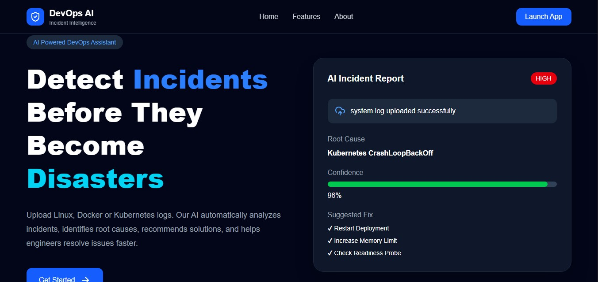
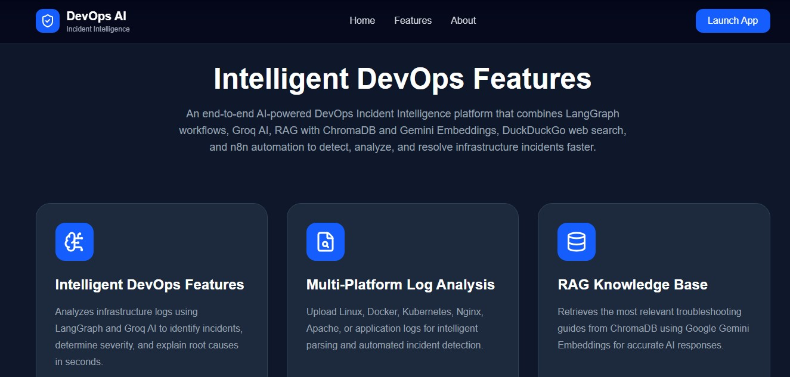
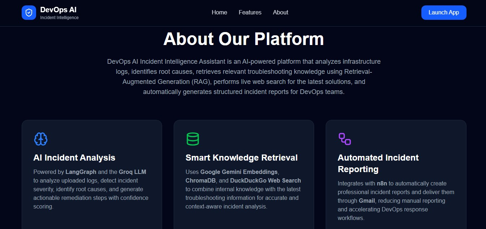
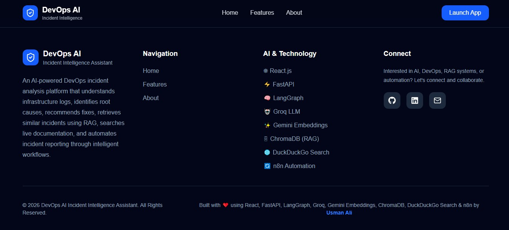
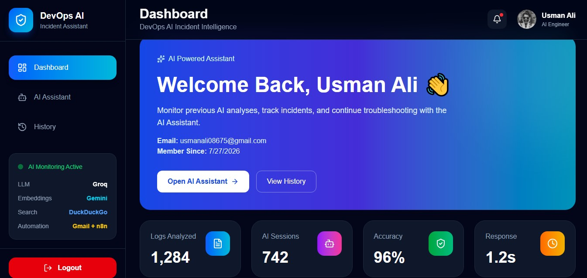
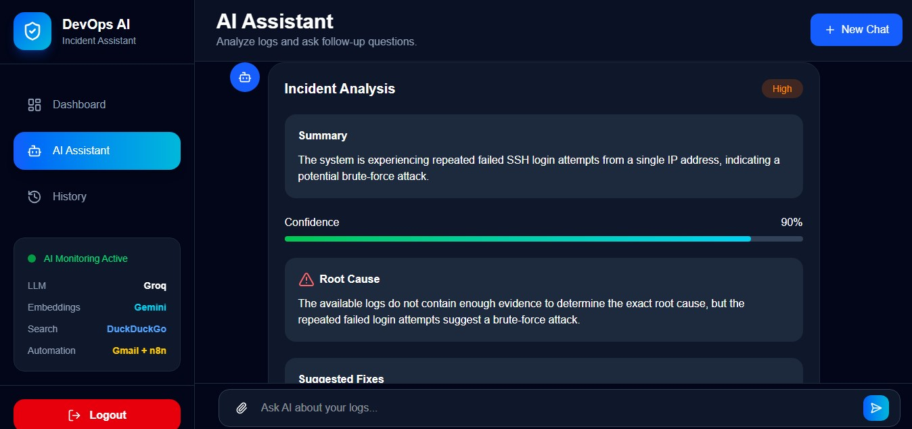
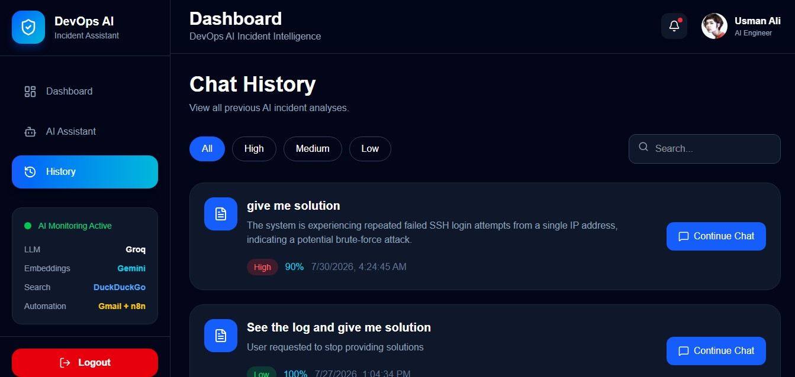

# 🚀 DevOps AI Incident Assistant

An AI-powered DevOps troubleshooting assistant that analyzes Linux, Kubernetes, Docker, and JSON logs using **LLMs, RAG, LangGraph, and Web Search** to provide root cause analysis, confidence scoring, suggested fixes, prevention strategies, and automated email notifications.

---

# 📌 Overview

DevOps AI Incident Assistant helps DevOps engineers, Site Reliability Engineers (SREs), Cloud Engineers, and System Administrators quickly diagnose infrastructure issues.

Instead of manually reading thousands of log lines, users can upload log files and ask natural language questions such as:

* Why did my Kubernetes pod crash?
* Why is my Linux server failing authentication?
* Explain this Docker error.
* Why is nginx returning 502?
* Analyze this system log.

The AI analyzes uploaded logs, retrieves relevant documentation using Retrieval-Augmented Generation (RAG), optionally searches the web for recent solutions, and returns a structured incident report.

---

# ✨ Features

* 🔍 Upload Linux, Kubernetes, Docker, and JSON logs
* 🤖 AI-powered incident analysis using Groq LLM
* 📚 Retrieval-Augmented Generation (RAG)
* 🌐 Optional web search for latest solutions
* 📊 Incident severity prediction
* 🎯 Confidence score
* 🔥 Root cause detection
* ✅ Suggested fixes
* 🛡 Prevention recommendations
* 📂 Chat history
* 💬 Continue previous conversations
* 📧 Automatic incident email notification using n8n
* 👤 JWT Authentication
* 📱 Responsive UI
* 🌙 Modern dark dashboard

---

# 🛠 Technology Stack

## Frontend

* React.js
* Vite
* Tailwind CSS
* React Router
* Axios
* Framer Motion
* Lucide React

---

## Backend

* FastAPI
* SQLAlchemy
* PostgreSQL
* LangGraph
* LangChain
* ChromaDB
* Groq API
* Google Gemini Embeddings
* DuckDuckGo Search
* JWT Authentication
* Alembic
* Python

---

## AI Stack

* Groq Llama 3.3 70B
* Google Gemini Embeddings
* LangGraph
* RAG Pipeline
* ChromaDB
* Prompt Engineering

---

## DevOps

* Railway 
* Vercel
* GitHub
* PostgreSQL
* n8n Automation

---

# 📂 Project Structure

```text
DevOps-AI-Assistant
│
├── frontend
│   ├── public
│   ├── src
│   │   ├── assets
│   │   ├── components
│   │   ├── context
│   │   ├── hooks
│   │   ├── pages
│   │   ├── routes
│   │   ├── services
│   │   ├── utils
│   │   └── App.jsx
│   ├── package.json
│   └── vite.config.js
│
├── backend
│   ├── app
│   │   ├── ai
│   │   ├── auth
│   │   ├── graph
│   │   ├── models
│   │   ├── rag
│   │   ├── routes
│   │   ├── services
│   │   ├── web_search
│   │   ├── database
│   │   ├── main.py
│   │   └── config.py
│   ├── alembic
│   ├── requirements.txt
│   └── .env.example
│
├── README.md
└── LICENSE
```

---

# 🧠 AI Workflow

```text
User Uploads Log
        │
        ▼
Log Parser
        │
        ▼
Extract Errors
Extract Services
Extract Keywords
        │
        ▼
RAG Retrieval
        │
        ▼
Relevant Documentation
        │
        ▼
Groq LLM
        │
        ▼
Need Web Search?
      /     \
    Yes      No
    │         │
    ▼         ▼
DuckDuckGo   Final Answer
    │
    ▼
Final LLM Response
    │
    ▼
Structured Incident Report
    │
    ▼
Send to Gmail 
```

---

# 📁 Supported File Types

* `.log`
* `.txt`
* `.json`

Maximum upload size:

```text
10 MB
```

---

# 🤖 AI Output

The assistant generates:

* Incident Summary
* Severity Level
* Confidence Score
* Incident Type
* Root Cause
* Evidence
* Suggested Fixes
* Prevention Tips
* Commands
* Sources
* Web Search Usage
* RAG Usage

---

# 🔒 Authentication

Authentication is implemented using JWT.

Features include:

* User Registration
* Login
* Password Hashing
* Protected Routes
* Secure API Access

---

# 📊 Dashboard

Dashboard provides:

* Total Chat Sessions
* Recent Incidents
* Incident Severity Overview
* Latest Analyses
* Continue Previous Chats

---

# 💬 Chat Features

* Upload logs
* Ask follow-up questions
* Multi-turn conversations
* Session memory
* Continue previous chats
* Chat history

---

# 📚 Retrieval-Augmented Generation (RAG)

The assistant retrieves relevant documentation before generating answers.

Current retrieval process:

* Parse uploaded logs
* Extract errors
* Extract services
* Extract keywords
* Build search query
* Search ChromaDB
* Retrieve relevant documents
* Send retrieved context to the LLM

---

# 🌐 Web Search

When the retrieved documentation is insufficient, the assistant performs an online search to fetch recent troubleshooting information.

---

# 📧 Email Automation

When a new log is uploaded:

1. Incident is analyzed.
2. AI generates a report.
3. Backend sends the report to n8n.
4. n8n emails the analysis automatically.

---

# 🚀 Deployment

## Frontend (Vercel)

Frontend URL:

```text
https://dev-ops-ai-incident-intelligence-as.vercel.app/
```

---

## Backend (Railway)

Backend URL:

```text
https://devops-ai-incident-intelligence-assistant-production.up.railway.app
```

---

## API Documentation

Swagger UI:

```text
ttps://devops-ai-incident-intelligence-assistant-production.up.railway.app/docs
```


---

# 🖥 Local Installation

## Clone Repository

```bash
git clone https://github.com/YOUR_USERNAME/DevOps-AI-Assistant.git

cd DevOps-AI-Assistant
```

---

## Backend

```bash
cd backend

python -m venv .venv

source .venv/bin/activate
```

Windows

```bash
.venv\Scripts\activate
```

Install dependencies

```bash
pip install -r requirements.txt
```

Run migrations

```bash
alembic upgrade head
```

Start backend

```bash
uvicorn app.main:app --reload
```

---

## Frontend

```bash
cd frontend

npm install

npm run dev
```

---

# 📸 Screenshots

## Landing Page









---

## Dashboard



---

## Chat Interface



---

## Incident Analysis

> Incident Analysis is shown in the AI Assistant interface above.

---

## History


---

# 🛣 Future Improvements

* Multi-LLM support
* Voice-based incident analysis
* PDF incident reports
* Grafana integration
* Prometheus alerts
* Slack notifications
* Microsoft Teams integration
* Kubernetes live monitoring
* CloudWatch integration
* Azure Monitor integration
* Elasticsearch support
* Persistent vector database

---

# 👨‍💻 Author

**Usman Ali**

Software Engineering Student

AI Engineer | Machine Learning Enthusiast | Full Stack Developer

GitHub:

```text
https://github.com/Engr-Usman-Ali
```

LinkedIn:

```text
https://www.linkedin.com/in/engr-usman--ali/
```

---

# 📄 License

This project is licensed under the MIT License.

---
